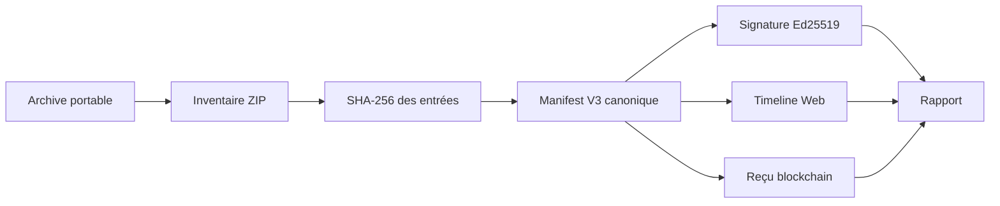
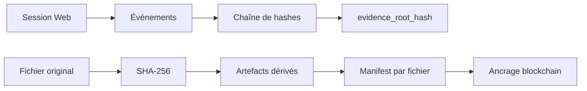

# Architecture de vérification

**Public :** experts judiciaires, experts numériques, auditeurs et RSSI.

Le vérificateur suit une chaîne de contrôles indépendante : lecture ZIP, déchiffrement avec le code fourni, inventaire des entrées, empreintes SHA-256, canonicalisation du manifeste, signature Ed25519, timeline Web, puis références blockchain.

## Séquences spécialisées

Les contrôles hors ligne ne nécessitent pas l’API PROOV-IT. Les contrôles blockchain utilisent un RPC public indiqué dans le manifeste ou fourni explicitement. Les réponses réseau sont traitées comme des données externes et doivent être conservées avec le rapport.

Les contrôles sont séparés par domaine afin qu’une donnée absente ou non applicable ne soit pas interprétée comme une altération d’un autre domaine. Les formats et algorithmes exacts sont décrits dans [les spécifications](../specs/PROOVIT-EVIDENCE-PROTOCOL.md), [le manifeste V3](../specs/MANIFEST-V3.md) et [la vérification blockchain](../specs/BLOCKCHAIN-VERIFICATION.md).

## Ordre et indépendance

Les contrôles locaux peuvent être réalisés sans API PROOV-IT. Les contrôles externes commencent uniquement après résolution d’une référence de transaction et d’un RPC public. Chaque résultat conserve sa source : archive, calcul local ou réponse réseau.
