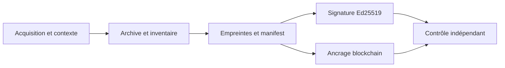

# Modèle de confiance

**Public :** experts judiciaires, experts numériques, auditeurs et RSSI.

## Objet du modèle de confiance

Le modèle sépare l'acquisition, la conservation, les calculs dérivés, les
attestations externes et la vérification indépendante. Il indique ce qu'un
tiers peut recalculer à partir de l'archive et des ressources publiques, et ce
qui reste une information enregistrée dans son contexte d'origine.

## Contrôles reproductibles indépendamment

À partir de l’archive et des ressources publiques, un tiers peut recalculer les empreintes des fichiers, la canonicalisation du manifeste, la signature Ed25519, la chaîne de timeline Web et les valeurs décodées d’un reçu blockchain lorsque le réseau est accessible.

## Contexte enregistré par la plateforme

Le navigateur, l’environnement d’exécution, l’URL demandée, l’identité de compte, la géolocalisation fournie par le terminal et certains identifiants d’appareil sont des informations enregistrées dans le contexte d’acquisition. Leur origine et leur portée doivent être appréciées avec les éléments du dossier.

## Données fournies par l’environnement client

La géolocalisation, les identifiants d’appareil et certaines dates peuvent provenir de l’environnement client. Elles sont conservées comme contexte d’acquisition et leur origine est indiquée lorsqu’elle est disponible.

## Données observées par le runner

Le navigateur ou le runner peut produire des observations telles que les URL, réponses, captures, ressources et événements de session. Leur présence dans l’archive est contrôlable ; la vérification ne rejoue pas automatiquement l’environnement distant.

## Données dérivées par PROOV-IT

Les empreintes, manifestes, artefacts de présentation, racines et résumés sont des valeurs dérivées. Leur calcul est contrôlable selon les spécifications publiées.

## Attestations externes

La blockchain publique, un jeton RFC3161 ou un stockage immuable peuvent fournir des attestations externes lorsqu’ils sont présents et contrôlables. Un jeton identifié comme non qualifié ne doit pas être présenté comme un horodatage qualifié.

## Périmètre d’interprétation

Le vérificateur établit des correspondances cryptographiques et des cohérences
techniques. L'interprétation de l'événement documenté, de son auteur, de la
recevabilité et de la force probante relève du contexte complet du dossier.

## Chaîne de confiance

| Donnée | Origine | Hashée | Manifestée | Signée | Blockchain | Offline | Tiers |
|---|---|---:|---:|---:|---:|---:|---:|
| Fichier original | Environnement / utilisateur | Oui | Oui | Indirectement | `metaHash` possible | Oui | Oui |
| Manifest | PROOV-IT | Oui | Oui | Oui | `dataHash` possible | Oui | Oui |
| Timeline | Runner / backend | Événements | Oui | Oui | Racine possible | Oui | Oui |
| Géolocalisation | Client | Selon manifest | Oui | Oui | Référence possible | Présence | Présence |
| Reçu blockchain | Réseau public | N/A | Référence | N/A | Oui | Non | Oui |

## Exigences de traitement sécurisé

Les implémentations doivent traiter les archives, JSON, HTML et réponses RPC comme des entrées non fiables : rejeter le JSON malformé, l’UTF-8 invalide, les signatures invalides, les chemins traversants et les décompressions excessives ; ne pas exécuter le HTML de l’archive comme du code de confiance.

## Pour aller plus loin

Voir [le protocole](../specs/PROOVIT-EVIDENCE-PROTOCOL.md), [le manifest V3](../specs/MANIFEST-V3.md) et [la provenance des données](PROVENANCE-DES-DONNEES.md).
